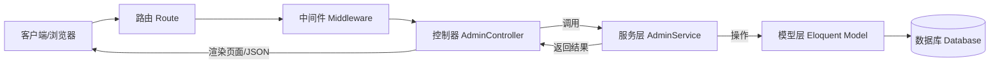

# AdminController 开发指南

## 目录

- [1. 概览](#1-概览)
  - [架构设计](#架构设计)
  - [核心类说明](#核心类说明)
- [2. 快速开始](#2-快速开始)
  - [创建控制器](#创建控制器)
  - [创建服务类](#创建服务类)
  - [路由注册](#路由注册)
- [3. 核心功能详解](#3-核心功能详解)
  - [列表页 (List)](#列表页-list)
  - [表单页 (Form)](#表单页-form)
  - [详情页 (Detail)](#详情页-detail)
  - [删除与批量操作](#删除与批量操作)
- [4. 高级特性](#4-高级特性)
  - [权限控制与矩阵](#权限控制与矩阵)
  - [数据导出](#数据导出)
  - [文件上传](#文件上传)
  - [快速编辑](#快速编辑)
- [5. API 参考](#5-api-参考)
  - [响应结构](#响应结构)
  - [异常码表](#异常码表)
  - [钩子方法](#钩子方法)
- [6. 最佳实践](#6-最佳实践)
  - [部署与回滚](#部署与回滚)
  - [性能优化](#性能优化)
  - [监控与告警](#监控与告警)
- [7. 附录](#7-附录)
  - [Postman 集合](#postman-集合)
  - [自动化测试用例](#自动化测试用例)

---

## 1. 概览

### 架构设计

Warm Admin 采用了经典的 **MVC + Service** 分层架构，旨在实现业务逻辑与表现层的解耦。



### 核心类说明

| 类名 | 路径 | 说明 |
| :--- | :--- | :--- |
| **AdminController** | `warm\admin\controller\AdminController` | 控制器基类，负责请求处理、参数校验、页面构建与响应格式化。 |
| **AdminService** | `warm\admin\service\AdminService` | 服务基类，封装 CRUD 逻辑、事务处理、数据转换与复杂业务。 |
| **BaseModel** | `warm\common\model\BaseModel` | 模型基类，继承自 Laravel Eloquent，提供基础 ORM 能力。 |

---

## 2. 快速开始

### 创建控制器

控制器位于 `plugin/admin/app/controller` 目录下，需继承 `AdminController`。

```php
<?php

namespace plugin\admin\app\controller;

use warm\admin\controller\AdminController;
use plugin\admin\app\service\UserService;

class UserController extends AdminController
{
    // 1. 绑定服务类
    protected string $serviceName = UserService::class;

    // 2. 定义无需权限验证的方法（可选）
    protected array $noNeedAuth = ['index'];

    // 3. 实现列表页
    public function list()
    {
        return $this->baseList()
            ->header(['title' => '用户管理'])
            ->body($this->table()->columns([
                $this->text('id', 'ID')->sortable(),
                $this->text('username', '用户名'),
                $this->datetime('created_at', '创建时间')
            ]));
    }

    // 4. 实现表单页
    public function form(bool $isEdit = false)
    {
        return $this->baseForm()->body([
            $this->inputText('username', '用户名')->required(),
            $this->inputPassword('password', '密码')->required(!$isEdit)
        ]);
    }
}
```

### 创建服务类

服务类位于 `plugin/admin/app/service` 目录下，需继承 `AdminService`。

```php
<?php

namespace plugin\admin\app\service;

use warm\admin\service\AdminService;
use plugin\admin\app\model\User;

class UserService extends AdminService
{
    // 1. 绑定模型
    protected string $modelName = User::class;

    // 2. 数据保存前钩子
    public function saving(array &$data, string $primaryKey = '')
    {
        if (!empty($data['password'])) {
            $data['password'] = password_hash($data['password'], PASSWORD_DEFAULT);
        } else {
            unset($data['password']); // 更新时不传密码则不修改
        }
    }
}
```

### 路由注册

在 `plugin/admin/config/route.php` 中注册路由：

```php
use Webman\Route;

// 自动注册资源路由
Route::resource('/user', plugin\admin\app\controller\UserController::class);
```

---

## 3. 核心功能详解

### 列表页 (List)

`index()` 方法负责列表展示。通过 `baseList()` 和 `table()` 快速构建 Amis 表格。

- **搜索**: 使用 `$this->baseFilter()` 构建搜索表单。
- **排序**: 字段链式调用 `->sortable()`。
- **关联**: 在 Service 中重写 `listQuery` 使用 `with()` 预加载。

```php
// Controller
public function list()
{
    return $this->baseList()
        ->filter($this->baseFilter()->body([
            $this->inputText('username', '用户名'), // 自动模糊搜索
            $this->select('status', '状态')->options(['1'=>'正常', '0'=>'禁用'])
        ]))
        ->body($this->table()->columns([
            $this->text('role.name', '角色'), // 关联字段
            // ...
        ]));
}

// Service
public function listQuery()
{
    return parent::listQuery()->with(['role']); // 预加载避免 N+1
}
```

### 表单页 (Form)

`create()` 和 `edit()` 复用 `form()` 方法。

- **验证**: 链式调用 `->required()`, `->validations('email')`。
- **布局**: 支持 `Group`, `Grid` 等布局组件。

### 详情页 (Detail)

`show()` 方法调用 `detail()` 构建详情视图。

```php
public function detail()
{
    return $this->baseDetail()->body([
        $this->detailText('id', 'ID'),
        $this->detailImage('avatar', '头像'),
        $this->detailJson('config', '配置信息')
    ]);
}
```

### 删除与批量操作

- **单删**: `DELETE /admin/user/{id}`
- **批删**: `DELETE /admin/user/{ids}` (ids 为逗号分隔字符串)
- **软删除**: 若模型使用了 `SoftDeletes` trait，默认执行软删除。

---

## 4. 高级特性

### 权限控制与矩阵

权限控制基于中间件拦截，分为两级：登录验证 (`Authenticate`) 和 权限验证 (`Permission`)。

#### 权限矩阵

| 属性 | 定义位置 | 作用 | 典型场景 |
| :--- | :--- | :--- | :--- |
| `$noNeedLogin` | Controller | **完全公开**，无需登录即可访问 | 登录页、注册页、公开回调 |
| `$noNeedAuth` | Controller | **需登录**，但无需具体权限节点 | 个人中心、公共配置读取、仪表盘 |
| 默认 | - | **严格验证**，需登录且拥有对应权限节点 | 用户管理、订单管理、系统设置 |

#### 示例
```php
protected array $noNeedLogin = ['login', 'captcha'];
protected array $noNeedAuth = ['dashboard', 'profile'];
```

### 数据导出

在控制器中无需额外代码，只需在 Service 中定义 `exportMap` 即可启用导出。请求列表接口带上 `_action=export` 参数。

```php
// Service
public function exportMap(): array
{
    return [
        'id' => 'ID',
        'username' => '用户名',
        'created_at' => '注册时间'
    ];
}
```

### 文件上传

使用 `upload` 方法，支持本地、OSS、七牛云等（需配置 `config/plugin/jizhi/warm/file.php`）。

```php
// Controller
public function uploadImage(Request $request)
{
    // file 为上传字段名
    return $this->upload($request, 'file'); 
}
```

### 快速编辑

支持在列表页直接修改字段。

1.  **Controller**: 字段设置 `->quickEdit(true)`。
2.  **Service**: 默认支持，无需额外代码。如需自定义逻辑，重写 `quickEdit` 方法。

---

## 5. API 参考

### 响应结构

所有接口统一返回 JSON 格式：

```json
{
  "code": 0,          // 状态码：0 成功，非 0 失败
  "msg": "操作成功",   // 提示信息
  "data": {           // 业务数据
    "items": [],      // 列表数据
    "total": 0        // 总数
  }
}
```

### 异常码表

| 错误码 (code) | 说明 | 解决方案 |
| :--- | :--- | :--- |
| **0** | **成功** | - |
| **1** | **通用业务错误** | 检查参数或业务逻辑，查看 msg 提示 |
| **401** | **未登录** | 跳转至登录页，携带 token 重新请求 |
| **403** | **无权限** | 联系管理员开通对应权限 |
| **404** | **资源不存在** | 检查 ID 是否正确或数据已被删除 |
| **422** | **参数验证失败** | 检查提交表单字段格式 |
| **500** | **服务器内部错误** | 查看 `runtime/logs` 日志排查 |

### 钩子方法

Service 层提供完整的生命周期钩子：

- `saving(array &$data, string $primaryKey)`: 保存前（新增/更新）
- `saved($model, bool $isEdit)`: 保存后
- `deleted(string $ids)`: 删除后
- `listQuery()`: 列表查询构造器
- `exportMap()`: 导出字段映射

---

## 6. 最佳实践

### 部署与回滚

#### 部署流程
1.  **代码更新**: `git pull`
2.  **依赖安装**: `composer install --no-dev --optimize-autoloader`
3.  **数据库迁移**: `php webman migrate` (如果使用 Laravel Migration)
4.  **重启服务**: `php webman reload` (平滑重启) 或 `php webman restart` (强制重启)

#### 回滚流程
1.  **代码回退**: `git reset --hard v1.0.0`
2.  **依赖回滚**: `composer install`
3.  **数据库回滚**: `php webman migrate:rollback`
4.  **重启服务**: `php webman restart`

### 性能优化

1.  **N+1 问题**: 在 `listQuery` 中务必使用 `with()` 预加载关联数据。
2.  **索引优化**: 确保 `searchable` 涉及的字段（如 `username`, `phone`）已建立数据库索引。
3.  **只查所需**: 列表页尽量只 select 需要展示的字段，避免 `select *`。

### 监控与告警

建议监控以下指标：
- **API 响应时间**: 超过 500ms 告警。
- **500 错误率**: 超过 1% 告警。
- **Worker 进程状态**: 进程退出或内存泄漏告警。

---

## 7. 附录

### Postman 集合

可直接导入 Postman 进行接口调试：

```json
{
	"info": {
		"name": "Warm Admin API",
		"schema": "https://schema.getpostman.com/json/collection/v2.1.0/collection.json"
	},
	"item": [
		{
			"name": "列表查询",
			"request": {
				"method": "GET",
				"url": {
					"raw": "{{host}}/admin/user?page=1&perPage=20&username=admin",
					"host": ["{{host}}"],
					"path": ["admin", "user"],
					"query": [
						{ "key": "page", "value": "1" },
						{ "key": "perPage", "value": "20" },
						{ "key": "username", "value": "admin" }
					]
				}
			}
		},
		{
			"name": "新增数据",
			"request": {
				"method": "POST",
				"header": [
					{ "key": "Content-Type", "value": "application/json" }
				],
				"body": {
					"mode": "raw",
					"raw": "{\"username\": \"test\", \"password\": \"123456\"}"
				},
				"url": {
					"raw": "{{host}}/admin/user",
					"host": ["{{host}}"],
					"path": ["admin", "user"]
				}
			}
		}
	]
}
```

### 自动化测试用例

基于 PHPUnit 的控制器测试示例：

```php
<?php

namespace plugin\admin\tests;

use support\test\BaseTestCase;

class UserTest extends BaseTestCase
{
    public function testIndex()
    {
        $response = $this->get('/admin/user');
        $this->assertEquals(200, $response->getStatusCode());
        $this->assertStringContainsString('用户管理', $response->getBody());
    }

    public function testStore()
    {
        $response = $this->post('/admin/user', [
            'username' => 'phpunit_user',
            'password' => '123456'
        ]);
        $this->assertEquals(200, $response->getStatusCode());
        $json = json_decode($response->getBody(), true);
        $this->assertEquals(0, $json['code']);
    }
}
```
